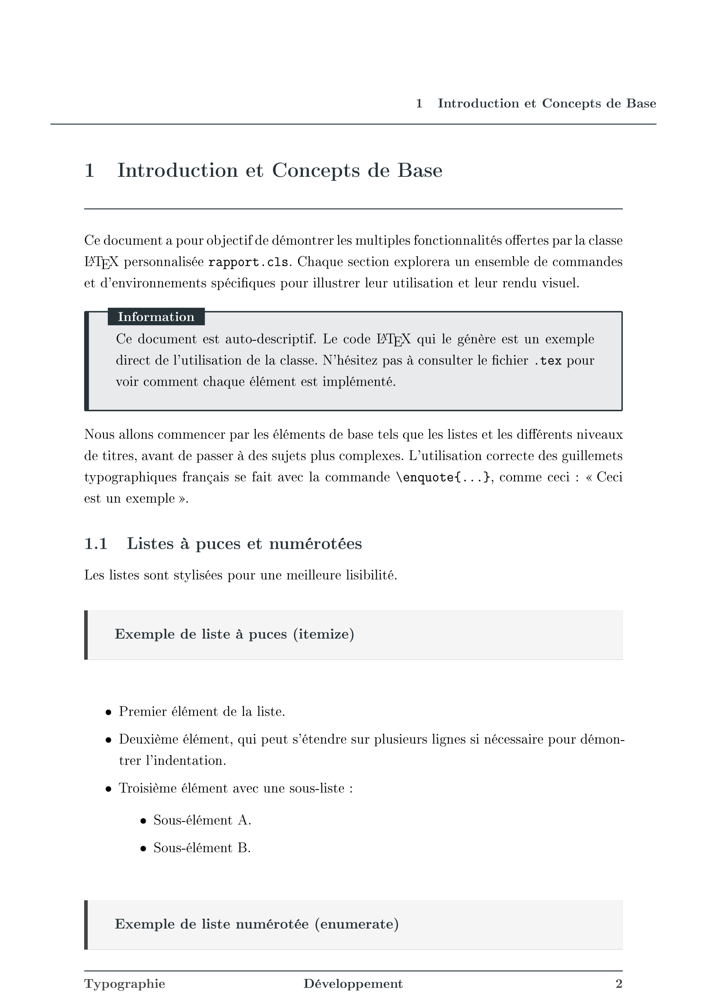
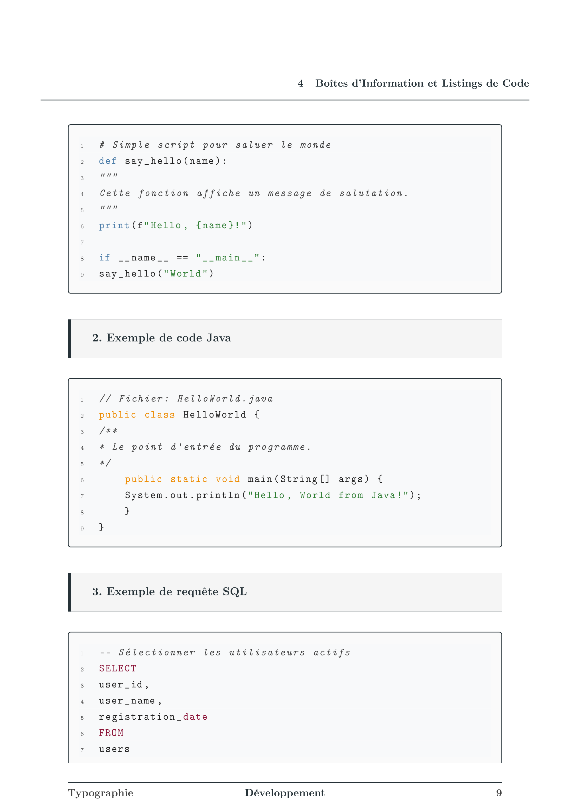

  

# Présentation
Un template LaTeX que j'utilise pour écrire les rapports des projets à rendre à l'IUT. Il permet une écriture rapide et simplifiée d'un document répondant à des standards académiques précis, en incluant l'insertion de boîtes de code (sql, c, java) avec une coloration syntaxique différente selon le langage. 

# Configuration
J'ai privilegié des couleurs et formes agréables à la lecture. Le template utilise des commandes simples qui s'exécutent dans le .cls pour minimiser les erreurs. 
Les couleurs sont discutables et j'aime toujours étudier leur impact à la lecture, mais ce choix reste subjectif : par conséquent les couleurs modifiables dans les *definecolor* du .cls et dans le call du \fairepagedegarde

# Utilisation
Document *sample* test.pdf + test.tex disponible (couvre tout)

à venir : butexEN pour traduction automatique avec constantes traduites

# Démonstrations

## Front page

## Page typique

## Utilisation des codebox (tcolorbox)

## Rendus

Je privilégie :

- Une écriture concise et aérée
- Des couleurs sobres (Noir | Gris foncé | Bleu foncé)
- La minimisation d'éléments distincts

L'objectif est de rendre la vie du lecteur / correcteur agréable. Il doit, au plus possible, passer un bon moment à la lecture.

### Développement efficace (Algorithmie)

- Utilisation de boîtes de pseudo-code
- Combinaison de figures / sous-figures et tableaux de comparaisons
- [Lien](https://github.com/blavogiez/developpement-modulab-Semestre3/blob/master/rendus/algo/rapport/G2_SAE3.3-Rapport_Algorithmie.pdf)

### Analyse UML

- [Lien](https://github.com/blavogiez/developpement-modulab-Semestre3/blob/master/rendus/analyse/rapport/G2_SAE3.3-Rapport_Analyse.pdf)

# Crédit
Fork (lointain) d'un thème de Centrale Lyon (probablement lui-même forké): [Thème de Centrale Lyon](https://fr.overleaf.com/latex/templates/rapport-centrale-lyon/rgbvxkxqvhtc)

